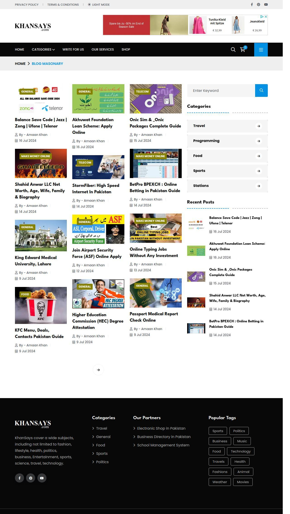
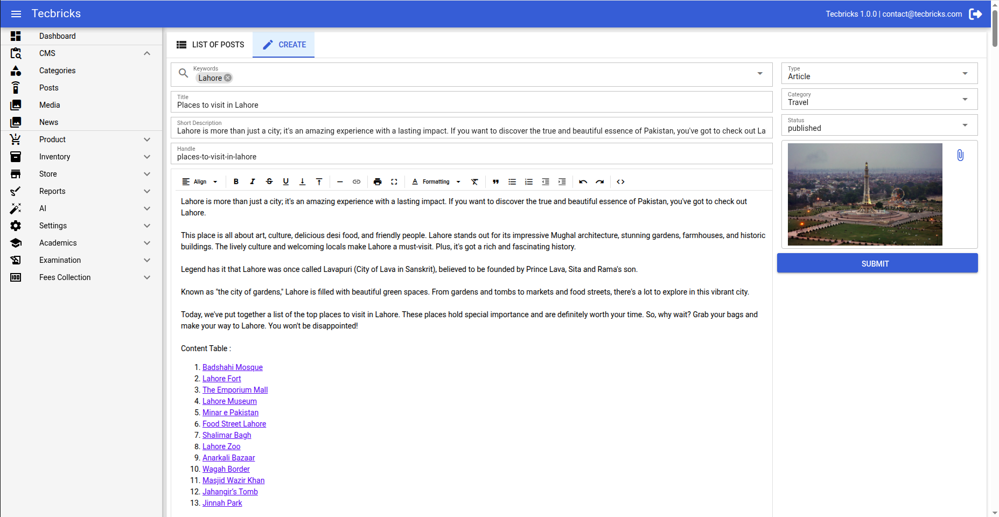
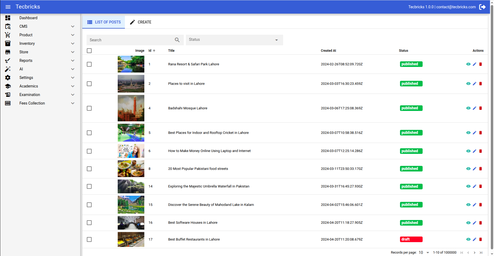
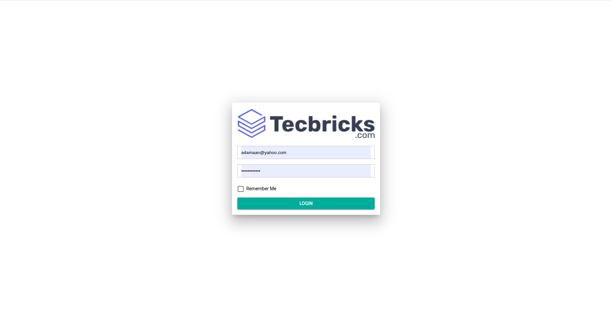
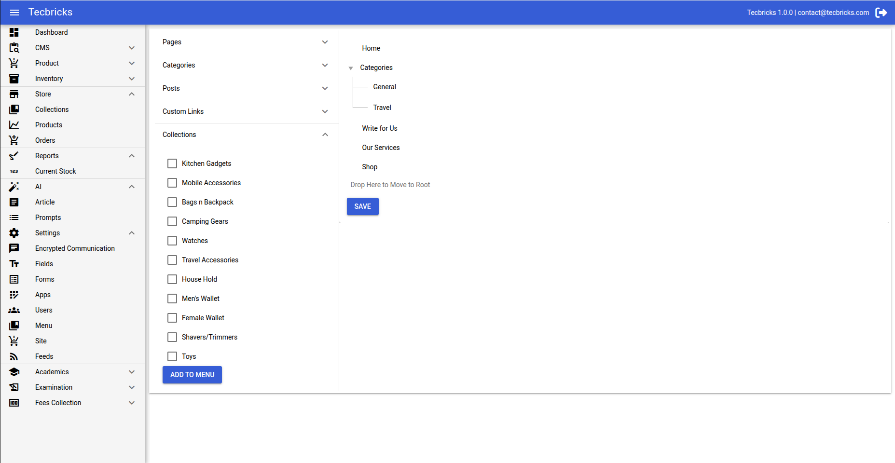

# Content Management System (CMS) by Tecbricks.com

Introducing Content Management System (CMS) – Your Ultimate Solution for a Powerful and Elegant CMS!

The perfect solution for this lies in a versatile and feature-rich Content Management System (CMS) that not only helps in publishing content but also integrates powerful AI tools, e-commerce management, and SEO optimization.

    

### Frontend Demo - https://khansays.com/

## ✅ Standard License Version

### Ready to Elevate Your Development Experience?

If you're looking to build elegant internal tools or CMS for your organization, head over to my [Sponsorship Page](https://khansays.com/post/content-management-system-cms-by-tecbricks) and unlock the full potential of the **Content Management System (CMS)**.

---

If you want to pay using PayPal, please contact me at a4amaan@yahoo.com.

Why Choose Tecbricks Content Management System?
1. Category Management
One of the primary features of a CMS is the ability to organize content into various categories. Effective category management allows users to easily structure their website’s content, ensuring that it is easily navigable and well-organized.

Customizable Categories: Add, edit, and delete categories at any time, allowing for flexibility in organizing different types of content such as blog posts, news articles, or product listings.
Hierarchical Structures: Create subcategories and nested categories, ensuring a clear and logical structure.
SEO-Friendly URLs: Each category can have its unique, optimized URL, making it easier for search engines to index the website efficiently.
2. Post Management
Post management is the backbone of a CMS, enabling users to create and edit various types of content seamlessly. With a powerful post management system, content creators can:

Rich Text Editing: Use WYSIWYG editors for rich text formatting, inserting images, embedding videos, and more.
Post Scheduling: Schedule posts to be published at specific dates and times, allowing for consistent content updates.
Post Categorization & Tagging: Easily assign categories and tags to posts to improve content discoverability and organization.
SEO Integration: Meta descriptions, keywords, and permalinks can be added directly to posts for better search engine optimization.
3. Media Management
A great CMS must provide robust media management tools that allow users to upload, organize, and display multimedia content such as images, videos, audio files, and documents.

Drag-and-Drop Interface: Simplifies the process of uploading files directly from your computer.
Media Library: Organize media files into folders or collections, ensuring easy access and efficient file management.
SEO Optimization for Images: Allows you to edit image alt tags and file names to improve your site’s search engine visibility.
4. AI Content Generation
The inclusion of AI content generation elevates the CMS from standard to exceptional. AI can now assist in creating high-quality, engaging content in a fraction of the time it would take a human.

Automated Article Creation: AI tools can generate blog posts, articles, and product descriptions by analyzing relevant data and existing content.
Natural Language Processing (NLP): Create content that resonates with target audiences by using AI models trained on vast datasets.
Content Suggestions: AI can offer ideas for posts, headlines, or keywords, making the content creation process smoother.
5. AI Image Generation
AI is not limited to text-based content—it is also transforming how images are generated and edited. AI image generation within the CMS enables you to:

Custom Image Creation: Use AI algorithms to generate images based on simple text prompts, ideal for unique blog post images, product visuals, or banners.
Image Customization: Modify and enhance images using AI-driven filters and effects that cater to specific branding needs.
No Copyright Concerns: Since the images are generated by AI, they come free of copyright issues, which is a significant advantage for businesses.
6. Store Products Management
For businesses with an e-commerce focus, store product management is a must-have feature in the CMS. This allows you to manage products, their details, and stock levels effortlessly.

Product Listings: Add and manage products with attributes like descriptions, prices, stock quantity, and categories.
Bulk Management: Upload or update product information in bulk, making large catalogs easy to handle.
Product Variants: Handle different versions of products (e.g., color, size) with ease, ensuring customers have a streamlined shopping experience.
7. Store Collection Management
Store collection management is vital for organizing products into logical groups or categories for customers to browse. This feature lets you:

Create and Edit Collections: Group products into curated collections based on themes, sales, or other criteria.
Automated Collections: Set up collections that automatically populate with products based on defined rules, such as tags or categories.
Featured Collections: Highlight specific collections on the homepage or category pages for promotional purposes.
8. Store Order Management
Efficiently managing customer orders is key to the success of any e-commerce business. The CMS should have a robust store order management system with features like:

Order Tracking: Monitor orders from placement through delivery, ensuring transparency and excellent customer service.
Automated Notifications: Send automated email or SMS notifications to customers about their order status.
Refunds & Returns: Manage customer requests for refunds and returns directly through the system, streamlining the process for both customers and support staff.
9. High-Speed Website
Speed is critical for both user experience and SEO rankings. A modern CMS must ensure high-speed website performance by:

Efficient Caching: Implement browser and server-side caching to reduce load times for returning visitors.
Content Delivery Networks (CDNs): Utilize CDNs to ensure content is delivered quickly, no matter where the user is located.
Minified Resources: Automatically compress and minify CSS, JavaScript, and HTML files for faster page loads.
10. Optimized for SEO
A well-optimized CMS ensures that your website is SEO-friendly from the ground up. SEO optimization features include:

Meta Tags and Schema Markup: Easily add meta titles, descriptions, and schema markup to improve how search engines interpret your content.
XML Sitemap Generation: Automatically generate and update XML sitemaps to make indexing easier for search engines.
SEO-Friendly URLs: Create clean, readable, and optimized URLs for all pages, posts, products, and categories.
Mobile Optimization: Ensure that your website is fully responsive and optimized for mobile users, a key factor for SEO ranking.

### A CMS with category, post, media management, AI content and image generation, store products and order management, high-speed website performance, and SEO optimization provides an all-in-one solution for businesses looking to manage both content and e-commerce. With these features, your website can not only serve your audience better but also enhance your search engine visibility, speed up your workflow, and grow your online presence.

#### This type of CMS is the future of web content management, combining traditional tools with cutting-edge AI and e-commerce functionalities to offer a holistic approach to running a successful online platform.

# Screenshots

Frontend Website

CMS

Post Creation

Post Listing

Product List

Product Setup

Login

Login Simple

Login With Card

Multi Level Draggable Tree Component

